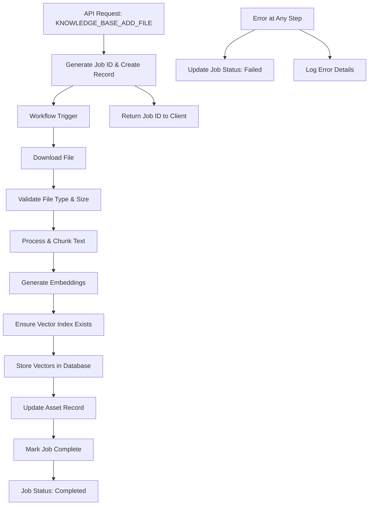

# Knowledge Base File Processing Workflow

A comprehensive Deco workflow system for asynchronous file processing in
knowledge base management, providing robust file handling, embedding generation,
and vector storage capabilities.

## Overview

This project implements a workflow-based system for processing files
asynchronously in knowledge base applications. It handles the complete pipeline
from file upload to vector storage, improving API response times and enabling
efficient processing of large files.

## Design Considerations

When implementing this workflow system, several key questions were addressed:

1. **Job Status Tracking**: Full job tracking with database persistence for
   transparency and debugging
2. **Result Handling**: Database-stored results with polling-based status
   updates
3. **Error Handling**: Comprehensive retry mechanisms with detailed error
   logging
4. **Batch Processing**: Support for processing multiple files with configurable
   batch sizes
5. **Workflow Orchestration**: Step-by-step execution with full observability

## Architecture

The workflow follows a sequential processing pipeline with comprehensive error
handling:



## Key Features

### 🔄 Workflow Processing

- **Job Status Tracking**: Database-backed job status with real-time updates
- **File Download**: Robust file downloading with comprehensive validation
- **File Processing**: Intelligent text chunking and metadata extraction
- **Embedding Generation**: OpenAI-powered text embeddings with batch processing
- **Vector Storage**: Turso vector database integration with automatic indexing
- **Asset Management**: Supabase asset record creation and updates
- **Error Handling**: Comprehensive error recovery with detailed logging

### 🎯 Workflow Benefits

- **Observability**: Full visibility into each processing step with detailed
  logs
- **Reliability**: Built-in retry mechanisms and graceful error handling
- **Scalability**: Workflow-based execution with efficient resource management
- **Debugging**: Step-by-step execution tracking and error isolation
- **Flexibility**: Modular design for easy extension and customization
- **Security**: Environment-based credential management with no sensitive data
  in payloads

## Project Structure

```
knowledge-base-file-process/
├── src/
│   ├── types/
│   │   ├── schemas.ts       # Zod schemas for all data types
│   │   └── env.ts           # Environment type definitions
│   ├── steps/
│   │   ├── job-status.ts    # Job tracking steps
│   │   ├── file-download.ts # File download and validation
│   │   ├── file-processing.ts # Text processing and chunking
│   │   ├── embeddings.ts    # Embedding generation
│   │   ├── vector-storage.ts # Vector database operations
│   │   └── asset-update.ts  # Asset record management
│   └── workflows/
│       └── file-processing.ts # Main workflow definition
├── main.ts                  # Application entry point
├── package.json
├── wrangler.toml           # Cloudflare Workers configuration
└── README.md
```

## Installation & Setup

1. **Install dependencies:**
   ```bash
   npm install
   ```

2. **Configure your workspace in `wrangler.toml`:**
   ```toml
   [deco]
   workspace = "your-workspace-name"
   ```

3. **Set up integrations in Deco dashboard:**
   - Supabase integration for database operations
   - OpenAI integration for embeddings
   - Turso integration for vector storage

4. **Deploy:**
   ```bash
   npm run deploy
   ```

## Usage

### Triggering File Processing

The workflow can be triggered programmatically or through the Deco interface:

```typescript
// Workflow input
const input = {
  jobId: "uuid-v4",
  workspaceId: "your-workspace",
  knowledgeBaseName: "kb-name",
  fileUrl: "https://example.com/file.pdf",
  filePath: "/path/to/file.pdf",
  userId: "user-id",
  metadata: { source: "upload" },
  createdAt: "2025-01-09T12:00:00Z",
};

// The workflow handles all processing steps automatically
```

### Monitoring Progress

Job status is tracked in the `deco_chat_file_processing_jobs` table:

```sql
SELECT 
  job_id,
  status,
  result,
  created_at,
  updated_at
FROM deco_chat_file_processing_jobs
WHERE job_id = 'your-job-id';
```

## Database Schema

### File Processing Jobs Table

This table tracks all file processing jobs with comprehensive metadata and
status information:

```sql
-- Migration: Add job tracking table
CREATE TABLE IF NOT EXISTS deco_chat_file_processing_jobs (
  id UUID PRIMARY KEY DEFAULT uuid_generate_v4(),
  job_id VARCHAR(255) UNIQUE NOT NULL,
  workspace_id VARCHAR(255) NOT NULL,
  file_path VARCHAR(500) NOT NULL,
  knowledge_base_name VARCHAR(255) NOT NULL,
  status VARCHAR(50) NOT NULL DEFAULT 'queued',
  result JSONB,
  user_id VARCHAR(255) NOT NULL,
  created_at TIMESTAMP WITH TIME ZONE DEFAULT NOW(),
  updated_at TIMESTAMP WITH TIME ZONE DEFAULT NOW()
);

-- Performance indexes
CREATE INDEX idx_file_processing_jobs_workspace ON deco_chat_file_processing_jobs(workspace_id);
CREATE INDEX idx_file_processing_jobs_status ON deco_chat_file_processing_jobs(status);
CREATE INDEX idx_file_processing_jobs_user ON deco_chat_file_processing_jobs(user_id);
CREATE INDEX idx_file_processing_jobs_created_at ON deco_chat_file_processing_jobs(created_at);
```

### Job Status Values

- **`queued`**: Job created and waiting to be processed
- **`processing`**: Job currently being executed by workflow
- **`completed`**: Job finished successfully with results stored
- **`failed`**: Job encountered an error during processing

### Result JSON Structure

The `result` JSONB column stores processing outcomes:

```json
{
  "docIds": ["uuid1", "uuid2", "..."],
  "chunksProcessed": 42,
  "fileSize": 1024576,
  "processingTimeMs": 5432,
  "stage": "completed",
  "error": "Error message if failed",
  "processedAt": "2025-01-09T12:00:00Z"
}
```

## Environment Variables Setup

The workflow inherits environment variables from the Cloudflare Worker
configuration. All credentials are managed through Deco integrations for
enhanced security.

### Required Environment Variables

```typescript
// Core environment variables (defined in wrangler.toml)
const REQUIRED_ENV_VARS = {
  // Core Deco environment
  DECO_CHAT_WORKSPACE: "Your workspace identifier",
  DECO_CHAT_API_JWT_PUBLIC_KEY: "JWT public key for authentication",

  // Database connections
  SUPABASE_URL: "Your Supabase project URL",
  SUPABASE_SERVER_TOKEN: "Supabase service role key",
  TURSO_ADMIN_TOKEN: "Turso admin token for workspace management",
  TURSO_ORGANIZATION: "Your Turso organization name",
  TURSO_GROUP_DATABASE_TOKEN: "Token for accessing Turso group database",

  // AI/ML services
  OPENAI_API_KEY: "OpenAI API key for embeddings generation",
};
```

### Security Notes

- **No Credentials in Payloads**: All sensitive credentials are inherited from
  environment variables, not passed through workflow data
- **Integration Management**: Credentials are managed through Deco dashboard
  integrations
- **Environment Isolation**: Different environments (dev/staging/prod) have
  separate credential sets

## Workflow Steps Explained

### 1. Create Job Record

- Creates initial job entry in database
- Sets status to "processing"
- Enables progress tracking

### 2. Download & Validate File

- Downloads file from provided URL
- Validates file type and size
- Handles various content types

### 3. Process File

- Extracts text content
- Generates chunks with overlap
- Creates metadata for each chunk

### 4. Generate Embeddings

- Uses OpenAI text-embedding-3-small
- Batches requests for large files
- Validates embedding quality

### 5. Store Vectors

- Ensures vector index exists
- Stores embeddings in Turso
- Associates content with metadata

### 6. Update Assets

- Updates or creates asset record
- Links file to processing results
- Tracks completion status

## Benefits of Workflow-Based Architecture

This workflow-based implementation provides significant advantages over
traditional synchronous processing:

1. **Improved API Response Times**: File upload endpoint returns immediately
   with job ID
2. **Better Error Handling**: Failed jobs can be retried automatically with full
   error context
3. **Scalability**: Workflow system can handle multiple concurrent file
   processing jobs
4. **Visibility**: Job status tracking provides transparency to users and
   administrators
5. **Reliability**: Comprehensive error recovery and detailed logging for
   troubleshooting
6. **Enhanced Security**: No sensitive credentials passed through workflow
   payloads
7. **Simplified Architecture**: Workflow execution inherits environment
   variables securely
8. **Efficient Payloads**: Workflow messages contain only essential data,
   optimizing performance

## Error Handling

The workflow includes comprehensive error handling at every step:

- **Automatic Retries**: Failed workflow steps can be retried with exponential
  backoff
- **Status Updates**: Job status is updated immediately when failures occur
- **Error Logging**: Detailed error information is captured with full context
- **Graceful Degradation**: Partial failures are handled appropriately without
  affecting other jobs
- **Recovery Mechanisms**: Failed jobs can be manually retried or debugged
  through the Deco dashboard

## Monitoring & Observability

- **Job Status**: Real-time status updates in database with detailed progress
  information
- **Workflow Logs**: Step-by-step execution logs with timing and performance
  metrics
- **Metrics**: Processing time, success rates, and resource utilization tracking
- **Alerts**: Configurable notifications for failed jobs and performance
  thresholds
- **Dashboard Integration**: Full integration with Deco dashboard for workflow
  monitoring

## Implementation Considerations

### Cost & Resource Management

- **Database Growth**: Job status table will grow over time - implement cleanup
  strategy for old records
- **Vector Storage Costs**: LibSQL/Turso costs for storing embeddings scale with
  file volume
- **OpenAI API Costs**: Embedding generation costs scale with content volume and
  model usage
- **Workflow Execution**: Consider execution time limits and resource allocation
  per workflow run

### Performance & Scalability

- **Workflow Throughput**: Monitor concurrent workflow executions and processing
  times
- **Database Performance**: Monitor job table queries as volume grows; consider
  partitioning by date
- **Vector Database Limits**: Be aware of Turso/LibSQL rate limits and
  connection pooling
- **Memory Usage**: Large files may consume significant memory during processing
- **Batch Processing**: Large files are processed in chunks to optimize memory
  usage
- **Rate Limiting**: Built-in delays prevent API overload and respect service
  limits

### Operational Complexity

- **Workflow Monitoring**: Monitor workflow execution status, success rates, and
  failure patterns
- **Environment Variable Management**: Ensure all required env vars are
  available to workflow workers
- **Debugging**: Workflow-based processing provides better debugging than async
  alternatives
- **Database Optimization**: Indexed job status queries for efficient monitoring

### User Experience

- **Latency Trade-offs**: Users must wait for processing completion (poll for
  status updates)
- **Status Communication**: Clear UI for job progress with detailed status
  stages
- **Failure Communication**: Users need to understand why processing failed and
  next steps
- **Timeout Handling**: Long-running jobs may timeout - consider file size
  limits and processing time expectations

### Data Consistency & Reliability

- **Job vs Asset State**: Potential for inconsistency between job status and
  actual asset state
- **Retry Logic**: Failed workflows can be retried without creating duplicate
  embeddings
- **Transaction Boundaries**: Job status updates and vector storage happen in
  separate transactions
- **Error Recovery**: Comprehensive error handling with detailed logging for
  troubleshooting

### Security & Compliance

- **Environment Variable Security**: Sensitive credentials are properly secured
  in worker environment
- **Job Payload Security**: Workflow data contains no sensitive information,
  only file references and metadata
- **Access Control**: Job status APIs require proper workspace access controls
- **Audit Trail**: Consider compliance requirements for processing logs and
  retention policies
- **Data Privacy**: File content is processed in memory and not permanently
  stored in workflow state

### Monitoring & Alerting

- **Workflow Health**: Monitor workflow execution times, success rates, and
  failure patterns
- **Database Performance**: Track job table query performance and growth metrics
- **Processing Metrics**: Monitor file processing success rates and error
  categorization
- **Cost Monitoring**: Track OpenAI API usage and vector storage costs for
  budget management
- **Failed Job Alerting**: Set up notifications for consistently failing
  workflows

### Alternative Architecture Considerations

- **Single Table Approach**: Could add job status to `deco_chat_assets` table
  (simpler but less flexible)
- **Event-Driven Updates**: Consider WebSocket/SSE for real-time status updates
  instead of polling
- **Batch Processing**: Consider processing multiple files in single workflow
  executions for efficiency
- **Background Cleanup**: Implement automated cleanup of old job records and
  failed processing artifacts
- **Caching Layer**: Add Redis/KV caching for frequently accessed job status
  information

## Deployment Checklist

1. **Database Migration**: Deploy the job tracking table and indexes
2. **Environment Variables**: Configure all required environment variables in
   Deco dashboard
3. **Integration Setup**: Configure Supabase, OpenAI, and Turso integrations
4. **Workflow Deployment**: Deploy the workflow code to Cloudflare Workers
5. **Testing**: Test with small files first to validate the complete pipeline
6. **Monitoring Setup**: Configure alerting for failed jobs and performance
   metrics
7. **Documentation**: Update API documentation with new asynchronous processing
   flow

## Development

### Running Tests

```bash
npm test
```

### Local Development

```bash
npm run dev
```

### Debugging

- Use Deco dashboard for workflow execution logs
- Check database for job status updates
- Monitor integration logs for API calls

## Contributing

1. Follow existing code patterns
2. Add comprehensive error handling
3. Update schemas for new data types
4. Test with various file types
5. Document any new environment variables

## License

This project follows the same license as the parent repository.
