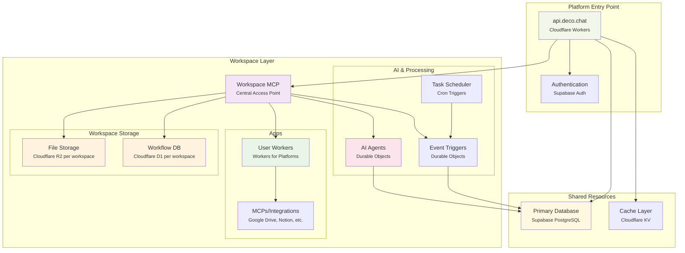
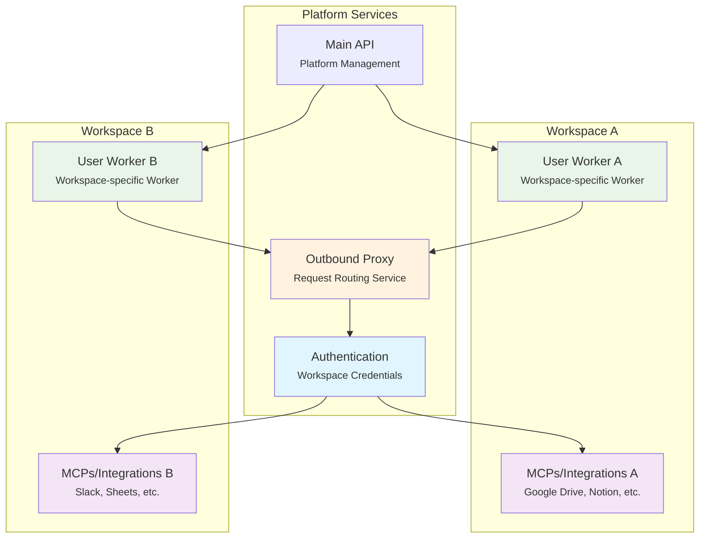

# Deco.chat Architecture

## Workspaces

A arquitetura do deco.chat é organizada em camadas funcionais que representam diferentes aspectos da aplicação. A camada de frontend inclui a aplicação web React hospedada via Cloudflare Pages, que se comunica através de uma CDN global. O backend é composto por serviços de API executados em Cloudflare Workers, que gerenciam autenticação via Supabase e processamento de requisições através de um proxy outbound para integrações externas.

A camada de Workspace é gerenciada pelo **Workspace MCP**, que atua como ponto central de acesso para todos os recursos específicos do workspace. Este componente coordena o acesso a três seções principais: **Apps** (detalhada na seção Cloudflare Workers for Platforms abaixo) que inclui os User Workers e MCPs/Integrações, **AI & Processing** que utiliza Durable Objects para manter estado persistente dos agentes conversacionais e triggers de eventos, complementada por um sistema de agendamento via Cron Triggers, e **Workspace Storage** que contém recursos de armazenamento específicos por workspace.

O Workspace MCP fornece uma interface unificada para acesso aos recursos isolados por workspace, incluindo file storage (Cloudflare R2), workflow database (Cloudflare D1), agentes de IA e integrações. O armazenamento é dividido em duas categorias: recursos compartilhados incluem o banco principal PostgreSQL do Supabase para dados estruturados e Cloudflare KV para cache de alta performance, enquanto recursos por workspace são acessados através do Workspace MCP e incluem Cloudflare R2 para arquivos e assets específicos do workspace e Cloudflare D1 para dados de workflows e métricas operacionais isolados por workspace. 

## Cloudflare Workers for Platforms

O deco.chat utiliza o Cloudflare Workers for Platforms para implementar um modelo de computação multi-tenant, onde cada workspace possui seus próprios workers isolados. Esta arquitetura permite que integrações customizadas sejam executadas de forma segura e independente para cada workspace.

### User Workers e Outbound Proxy

### Autenticação de MCPs

Apenas os **user workers** (workers específicos de cada workspace) utilizam o outbound proxy para autenticar chamadas para os MCPs. Esta abordagem garante:

- **Isolamento de Segurança**: Cada workspace tem suas próprias credenciais e permissões
- **Autenticação Centralizada**: O serviço de autenticação gerencia todas as credenciais de integração
- **Controle de Acesso**: Apenas workers autorizados podem acessar integrações específicas
- **Auditoria**: Todas as chamadas para MCPs são rastreadas e logadas

O fluxo de autenticação funciona da seguinte forma:

1. **User Worker** recebe uma requisição para acessar uma integração (ex: Google Drive)
2. **User Worker** faz uma chamada para o **Outbound Proxy** com o token do workspace
3. **Outbound Proxy** valida o token e encaminha para o serviço de **Authentication**
4. **Authentication** recupera as credenciais específicas do workspace e autentica a chamada com a integração externa (MCP)
5. **Authentication** retorna a resposta autenticada através do **Outbound Proxy** para o **User Worker**

Esta arquitetura permite que cada workspace tenha suas próprias integrações configuradas de forma independente, enquanto mantém a segurança e o controle centralizados através do outbound proxy e do serviço de autenticação. 