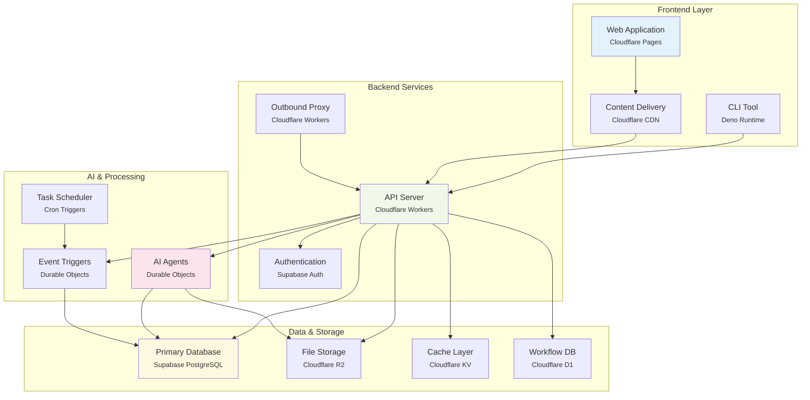

# Deco.chat Architecture

## Application Components

A arquitetura do deco.chat é organizada em camadas funcionais que representam diferentes aspectos da aplicação. A camada de frontend inclui a aplicação web React hospedada via Cloudflare Pages e uma ferramenta CLI, ambas se comunicando através de uma CDN global. O backend é composto por serviços de API executados em Cloudflare Workers, que gerenciam autenticação via Supabase e processamento de requisições através de um proxy outbound para integrações externas.

A camada de processamento de IA utiliza Durable Objects para manter estado persistente dos agentes conversacionais e triggers de eventos, complementada por um sistema de agendamento via Cron Triggers. O armazenamento de dados é distribuído entre o banco principal PostgreSQL do Supabase para dados estruturados, Cloudflare R2 para arquivos e assets, Cloudflare KV para cache de alta performance, e Cloudflare D1 para dados de workflows e métricas operacionais. 