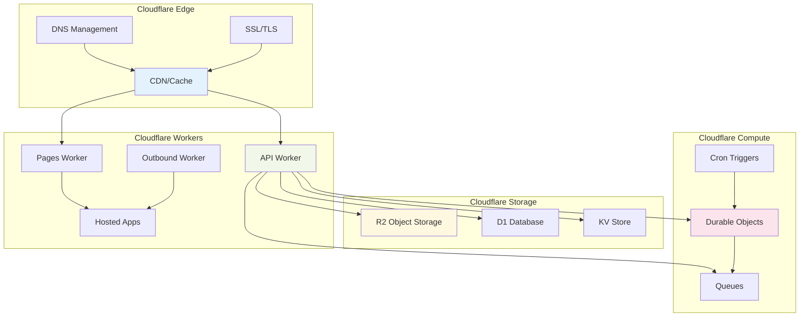

# Deco.chat Architecture

## Infrastructure Components

A arquitetura do deco.chat é construída inteiramente sobre a plataforma Cloudflare, aproveitando seus serviços de edge computing para criar uma solução escalável e distribuída globalmente. O sistema utiliza Cloudflare Workers para executar a lógica de backend, Cloudflare R2 para armazenamento de objetos, D1 para banco de dados SQL, e Durable Objects para manter estado dos agentes de IA. Esta arquitetura edge-first garante baixa latência e alta disponibilidade em qualquer região do mundo.

Os componentes principais incluem o API Worker que gerencia todas as operações de backend, o Pages Worker que roteia aplicações hospedadas dinamicamente, e o Outbound Worker que funciona como proxy para requisições externas. O armazenamento é distribuído entre R2 (arquivos e assets), D1 (workflows e métricas), e KV Store (cache e configurações), enquanto os Durable Objects mantêm o estado conversacional dos agentes de IA e processam triggers em tempo real. 