# Deco.chat Architecture

## Overview

deco.chat is an extensible, self-hosted AI workspace for building intelligent, UI-rich AI Agents that integrate seamlessly with internal tools and data. It's built as a modern web application following a microservices architecture powered by Cloudflare Workers and Deno.

### Core Concept

deco.chat is an **Agent Builder application** that allows users to:
- Connect integrations (Google Drive, Sheets, Notion, or custom ones)
- Create AI Agents with system instructions and available tools
- Deploy agents that provide rich, interactive UI experiences
- Manage workspaces with team collaboration features

## Technology Stack

- **Frontend**: React 19, Tailwind CSS v4, Vite, shadcn/ui
- **Backend**: Deno, TypeScript, Hono (API framework)
- **Database**: Supabase (PostgreSQL)
- **Storage**: Cloudflare R2
- **Infrastructure**: Cloudflare Workers, Cloudflare Pages
- **AI/ML**: Multiple providers (OpenAI, Anthropic, Google, DeepSeek, etc.)
- **Protocol**: Model Context Protocol (MCP) for tool communication
- **Authentication**: Supabase Auth with JWT tokens

## High-Level Architecture

## System Components

### 1. Frontend Applications

#### Web Application (`apps/web`)
- **Type**: React 19 SPA built with Vite
- **Hosting**: Cloudflare Pages
- **Features**:
  - Agent builder interface
  - Chat interface with rich UI components
  - Workspace management
  - Team collaboration tools
  - Integration management

#### CLI Tool (`packages/cli`)
- **Type**: Deno-based command-line interface
- **Features**:
  - Authentication management
  - Application deployment
  - Workspace operations
  - Local development tools

### 2. Backend Services

#### API Service (`apps/api`)
- **Type**: Hono-based API running on Cloudflare Workers
- **Domain**: `api.deco.chat`
- **Features**:
  - MCP (Model Context Protocol) server
  - Authentication & authorization
  - CRUD operations for agents, integrations, teams
  - File management
  - Webhook handling

#### Outbound Service (`apps/outbound`)
- **Type**: Proxy service for external requests
- **Purpose**: Handle authentication for hosted applications
- **Features**:
  - JWT token management
  - Request proxying
  - Supabase integration for app metadata

#### Pages Worker (`apps/pages`)
- **Type**: Dynamic routing service
- **Domain**: `*.deco.page`
- **Purpose**: Route requests to appropriate hosted applications
- **Features**:
  - Subdomain-based routing
  - Application dispatch
  - Error handling

### 3. AI & Processing Layer

#### AI Agents (Durable Objects)
- **Type**: Cloudflare Durable Objects
- **Features**:
  - Stateful AI agent execution
  - Memory management
  - Tool execution
  - Streaming responses
  - Multi-model support

#### Triggers (Durable Objects)
- **Type**: Cloudflare Durable Objects
- **Features**:
  - Webhook handling
  - Scheduled tasks
  - Event processing
  - Channel management

### 4. Data Layer

#### Supabase (Primary Database)
- **Type**: PostgreSQL with real-time features
- **Key Tables**:
  - `deco_chat_agents`
  - `deco_chat_integrations`
  - `deco_chat_teams`
  - `deco_chat_channels`
  - `deco_chat_hosting_apps`
  - `deco_chat_api_keys`
  - `profiles`
  - `members`

#### Cloudflare R2 (File Storage)
- **Purpose**: File storage with CDN capabilities
- **Features**:
  - Workspace-specific buckets
  - Pre-signed URLs
  - CORS configuration
  - Asset management

#### D1 Database (Workflows)
- **Type**: Cloudflare D1 (SQLite)
- **Purpose**: Workflow execution and state management
- **Features**:
  - Workflow run tracking
  - Step execution logs
  - Performance metrics

## Data Flow Architecture

## Model Context Protocol (MCP) Architecture

deco.chat uses MCP as its core communication protocol for tools and integrations:

## Infrastructure Components

### Cloudflare Services

### Authentication & Security

## Database Schema Overview

### Core Tables

## Deployment Architecture

## Integration Architecture

### External Integrations

## Performance & Scaling

### Caching Strategy

## Security Architecture

### Security Layers

## Monitoring & Observability

### Observability Stack

## Development Workflow

### Development Process

```mermaid
graph LR
    subgraph "Local Development"
        Code[Code Changes]
        Deno[Deno Dev Server]
        Local[Local Testing]
    end
    
    subgraph "Version Control"
        Git[Git Repository]
        Branch[Feature Branches]
        PR[Pull Requests]
    end
    
    subgraph "CI/CD Pipeline"
        Build[Build & Test]
        Deploy[Deploy to Staging]
        Prod[Deploy to Production]
    end
    
    subgraph "Monitoring"
        Health[Health Checks]
        Metrics[Metrics Collection]
        Alerts[Alert System]
    end
    
    Code --> Deno
    Deno --> Local
    Local --> Git
    Git --> Branch
    Branch --> PR
    PR --> Build
    Build --> Deploy
    Deploy --> Prod
    Prod --> Health
    Health --> Metrics
    Metrics --> Alerts
    
    style Code fill:#e8f5e8
    style Git fill:#f1f8e9
    style Build fill:#e3f2fd
    style Health fill:#fff8e1
```

## Conclusion

deco.chat represents a modern, scalable architecture for AI agent development and deployment. The system leverages Cloudflare's edge computing capabilities, Supabase's database and authentication services, and a robust MCP-based tool system to provide a comprehensive platform for building intelligent agents.

Key architectural strengths:
- **Edge-first design** with global distribution
- **Microservices architecture** for scalability
- **Type-safe communication** via MCP
- **Rich ecosystem** of integrations
- **Comprehensive security** with RBAC
- **Developer-friendly** tools and APIs

The architecture is designed to support rapid development, easy deployment, and seamless scaling as the platform grows.